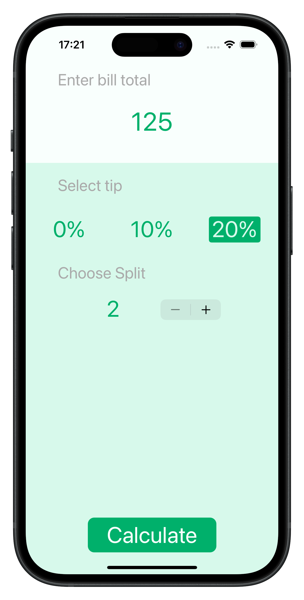
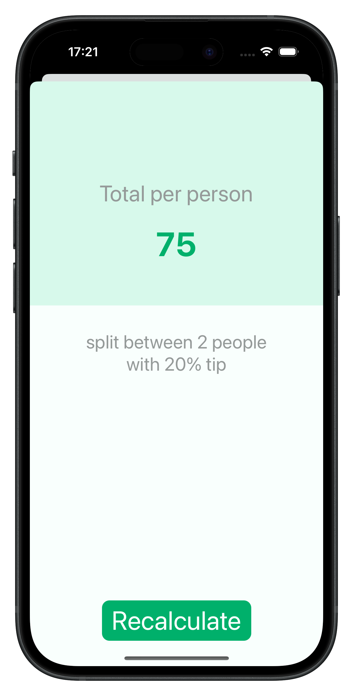

#  Tipsy - Bill Splitter App  

Tipsy is a mobile application built with **Swift and UIKit** that helps users easily calculate tips and split bills among participants.  

---

## 🚀 **Features**  

✅ Enter bill amount  
✅ Choose tip percentage (0%, 10%, 20%)  
✅ Set the number of people splitting the bill  
✅ Automatically calculate the amount per person  
✅ Clean and intuitive interface using UIKit  

---

## 🎥 **Screenshots**  

### 📱 Main Screen  
  

### 🧮 Calculation Screen  
  

---

## 🛠 **Technologies & Tools**  
  
- **UIKit**  
- **Storyboard & Auto Layout**  
 

---

## 🎯 **What I Learned While Building This App?**  

📌 **Working with UIKit UI components (`UITextField`, `UIButton`, `UIStepper`)**  
📌 **Passing data between view controllers (`prepare(for segue:)`)**  
📌 **Handling optional values in Swift (`??` for default values)**  
📌 **Formatting numbers and strings (`String(format: "%.2f", value)`)**  
 

---

